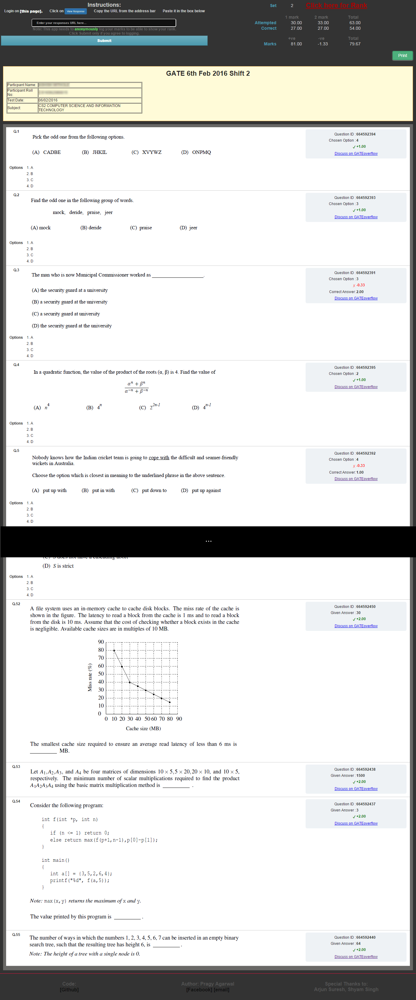
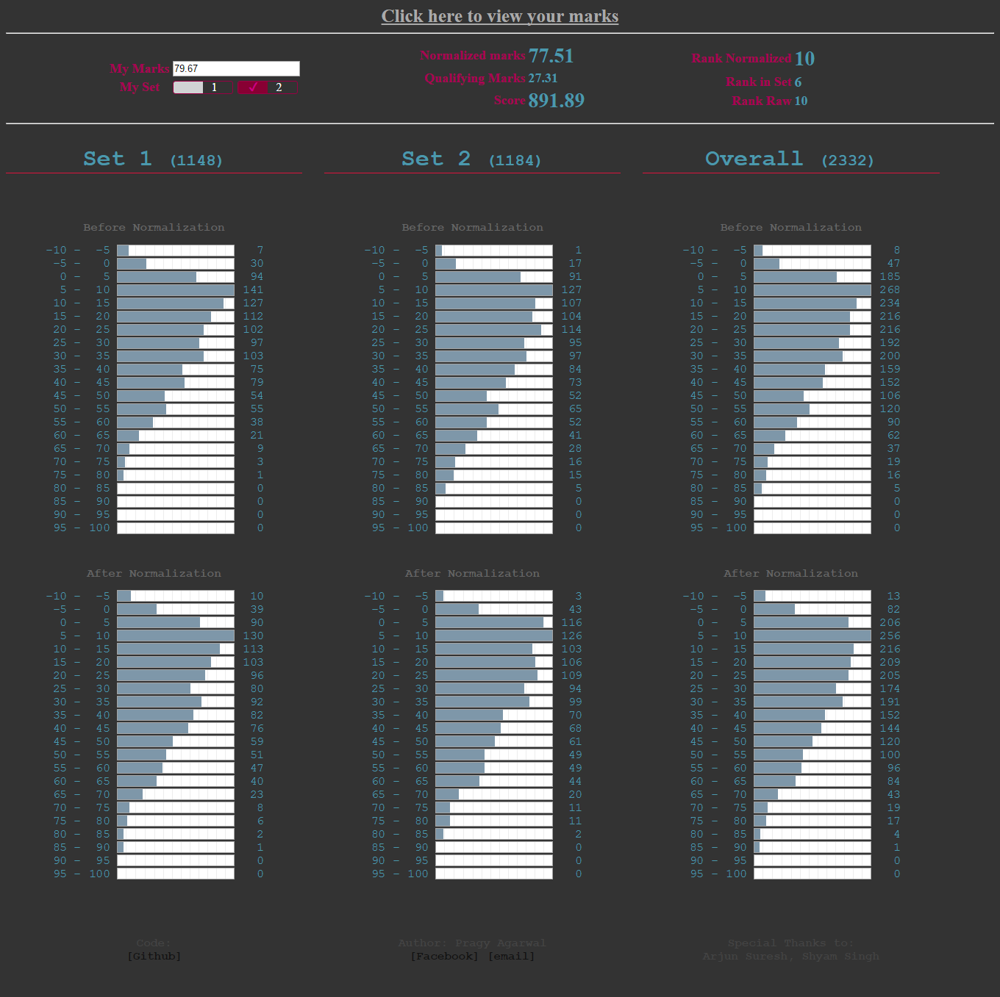

GATE2016_MarksEvaluator
-
A simple utility to find your GATE'16 CSE marks based on gateoverflow keys.

#### http://gateoverflow.in/mymarks/
#### http://gateoverflow.in/mymarks/VisualizeMarks.php

- The data logged is a (uid: marks) pair.
- Rank is not the GATE rank estimate. It just shows you your performance w.r.t other people who used this interface.

-- --

Instructions for use
-

- Login on the [GOAPS portal](http://appsgate.iisc.ernet.in/)
- Click on 
- Copy the URL from the address bar
- Paste it in the URL input box on [**this page**](http://127.0.0.1/GATE16/GATE16MarksEvaluator/index.php)

Screenshots
-

#### Calculate marks

#### Find rank & Visualize data

