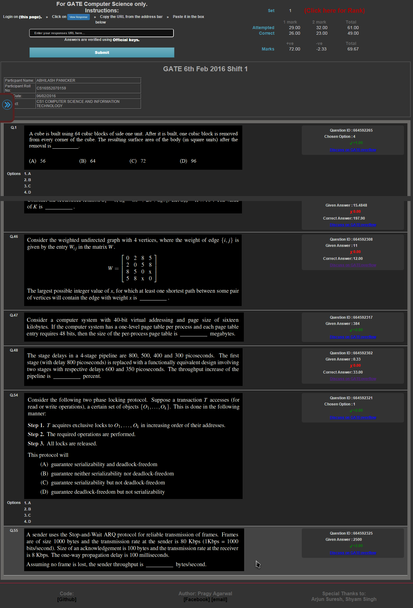
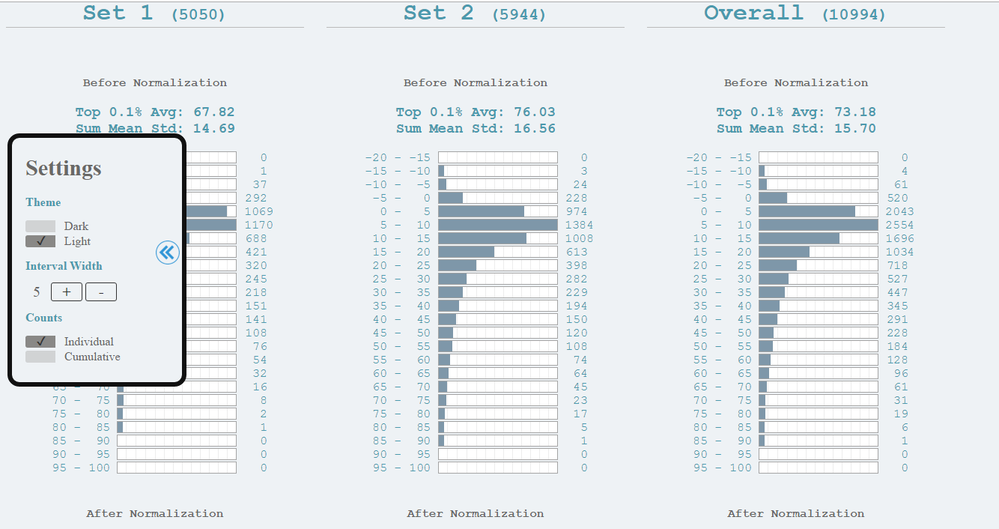

GATE2016_MarksEvaluator
-
A simple utility to find your GATE'16 CSE marks based on gateoverflow keys.

#### [gateoverflow.in/mymarks](http://gateoverflow.in/mymarks/)
#### [gateoverflow.in/mymarks/VisualizeMarks.php](http://gateoverflow.in/mymarks/VisualizeMarks.php)

#### The data logged is a (uid: marks) pair.

-- --

Instructions for use
-

- Login on the [GOAPS portal](http://appsgate.iisc.ernet.in/)
- Click on 
- Copy the URL from the address bar
- Paste it in the URL input box on [**this page**](http://127.0.0.1/GATE16/GATE16MarksEvaluator/index.php)

Screenshots
-

#### Calculate marks

#### Find rank & Visualize data

Dark Theme:

Light Theme:

